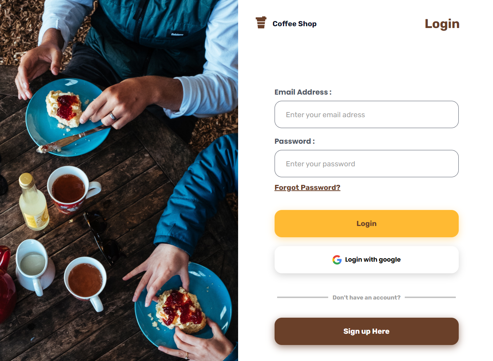
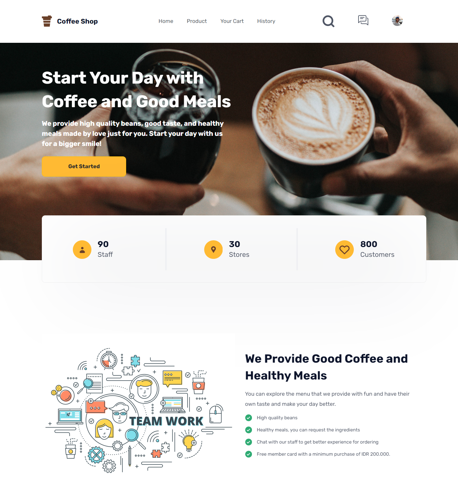
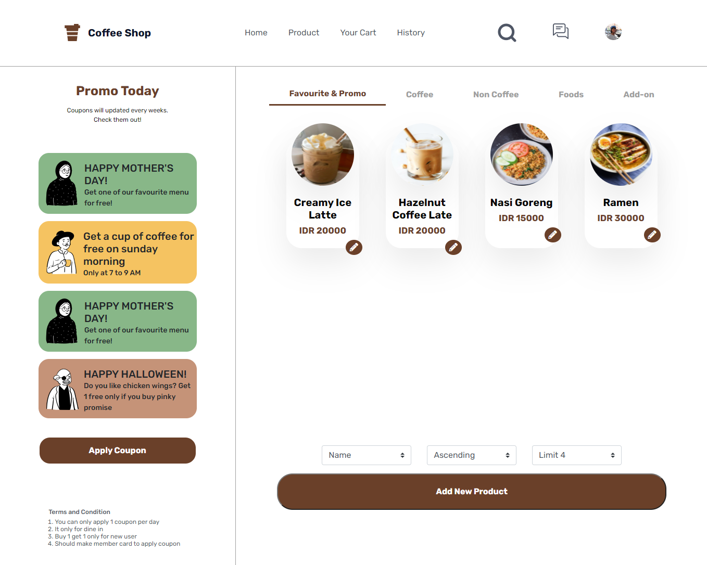
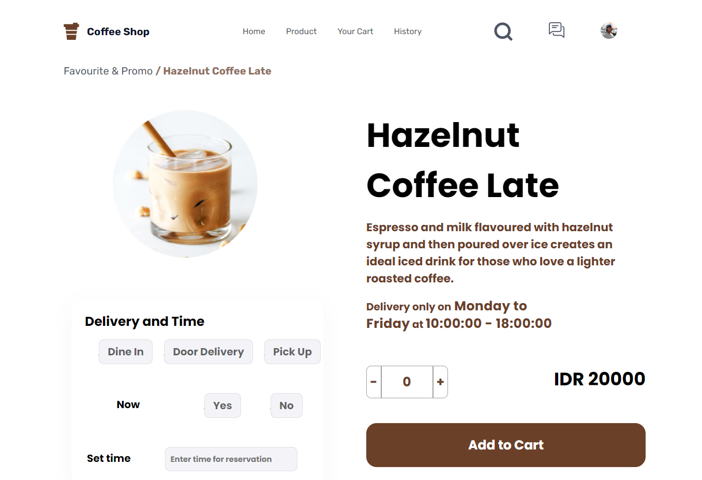
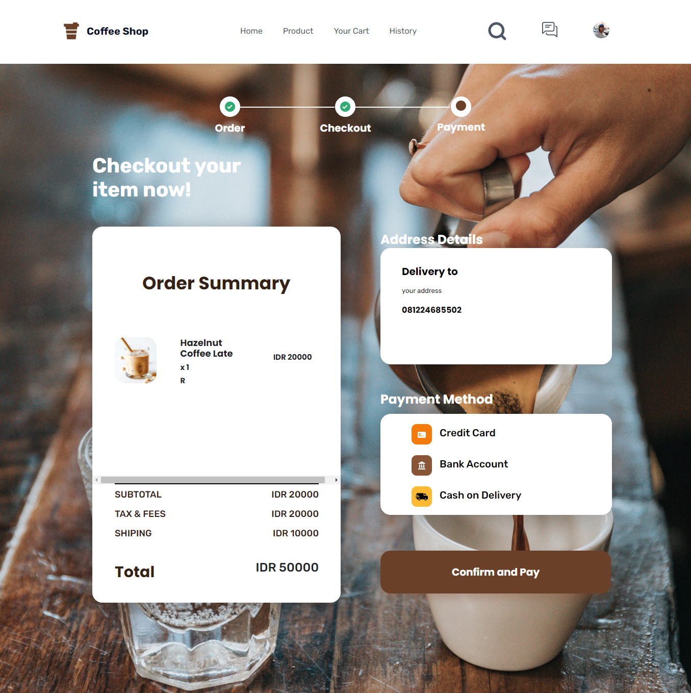
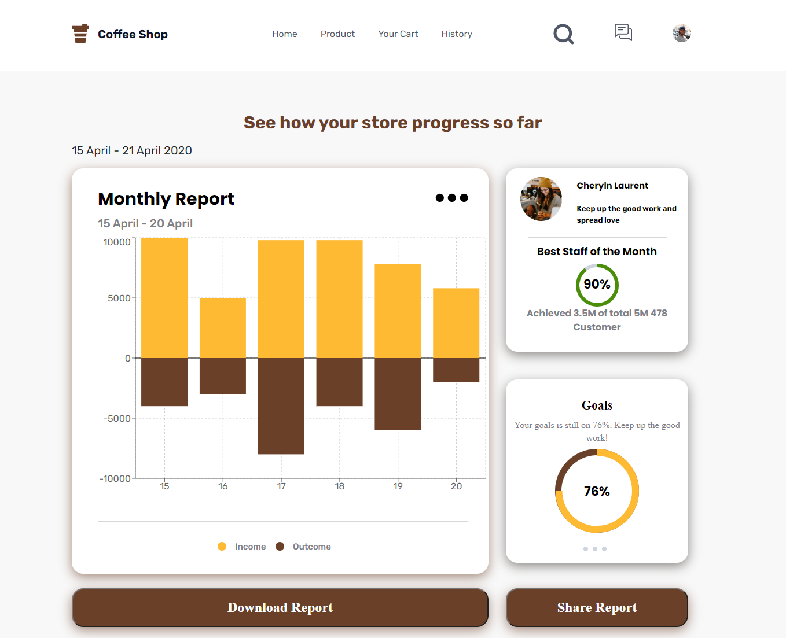

# Bohdan Coffee Shop

Bohdan Coffee is a food ordering service application that gives full flexibility to customers to place menu orders on their respective gadgets with direct payment options connected to the application. Premium features for a fast, effective and economical solution.

## Features

- Authentication

- Authorization

- Reset password

- Realtime product search

- Order product

- Change profile

- Upload image profile and product

## Built With

- [ReactJs](https://reactjs.org/)
- [Redux](https://redux.js.org/)
- [Bootstrap](https://getbootstrap.com/)

## Prerequisites

- [NodeJs](https://nodejs.org/en/download/)
- [Backend Bohdan Coffee](https://github.com/bohdan-28/coffee-shop-backend)

## Installation

1. Open your terminal or command prompt. Then, clone the repo.

```
$ git clone https://github.com/chaerulmarwan20/coffee-shop-frontend.git
```

2. Open this project.

```
$ cd coffee-shop-frontend
$ npm install
```

3. Create environment variable.

```
$ cp .env.example .env
```

4. Run this application.

```
$ npm start
```

## Tentang Bohdan Developer

This web application was developed by Bohdan Developer, a team of 5 people.

1. [Herza Paramayudhanto](https://github.com/herzaparam) - Backend - PM
2. [Chaerul Marwan](https://github.com/chaerulmarwan20) - Full Stack - Member
3. [Abu Dzar Al-ghifari](https://github.com/abudzr) - Frontend - Member
4. [Nevalen Aginda Prasetyo](https://github.com/nevalenaginda) - Backend - Member
5. [Kevin Farid Alpharisy](https://github.com/kevinfaridap) - Frontend -Member

## Screenshots

<p align="center">
  <span>
       
       
       
    
       
    
  </span>
</p>

## Link:

- [Backend](https://github.com/bohdan-28/coffee-shop-backend)
- [Visit Project](https://coffee-shop-bohdan.netlify.app/)
